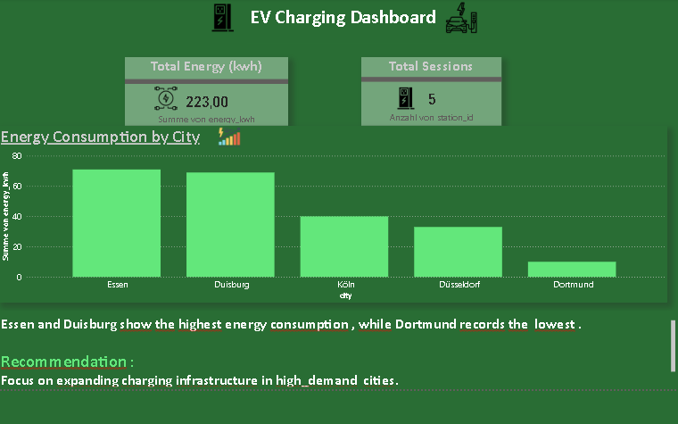

# ⚡ EV Charging Dashboard

This project analyzes electric vehicle (EV) charging patterns across different cities to identify high-demand areas and support data-driven infrastructure planning.

---

## 🎯 Project Objective

The goal of this project is to:
- Compare energy consumption across cities
- Identify high and low demand areas
- Provide actionable recommendations for EV charging infrastructure expansion

---

## ❓ Business Questions

- Which city has the highest energy consumption?
- Which city has the lowest energy usage?
- How does charging demand vary between cities?
- Where should EV charging infrastructure be expanded?

---

## 📊 Key Metrics

- **Total Energy Consumption:** 223 kWh  
- **Total Charging Sessions:** 5  

---

## 🧠 Insights (Data Analysis)

- **Essen and Duisburg** show the highest energy consumption at approximately **70 kWh each**, indicating strong demand for EV charging in these cities.
  
- **Köln and Düsseldorf** have moderate energy usage, ranging between **40–50 kWh**, suggesting stable but lower demand compared to top cities.
  
- **Dortmund** records the lowest energy consumption at around **15 kWh**, indicating limited EV charging activity.

---

## 📈 Interpretation of Results

- High consumption in Essen and Duisburg suggests these cities have more EV users or higher charging frequency.
- Moderate usage in Köln and Düsseldorf indicates growing but not peak demand.
- Low usage in Dortmund may indicate fewer EV users or underdeveloped charging infrastructure.

---

## 💡 Recommendations

- Expand charging infrastructure in **high-demand cities** like Essen and Duisburg to support increasing usage.
- Monitor cities like Köln and Düsseldorf for future growth opportunities.
- Investigate low usage in Dortmund to determine whether the issue is low demand or lack of infrastructure.

---

## 🛠 Tools Used

- Power BI (Data Visualization & Dashboard Design)

---
## Data Preparation
SQL was used to join tables and aggregate data (SUM , COUNT) for analysis.

---

## 📊 Dashboard Preview

